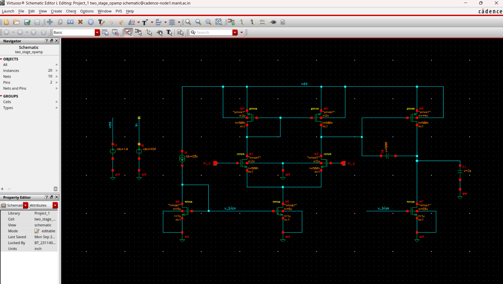

# CMOS-Two-Stage-Operational-Amplifier-Design----Cadence-Virtuoso

## Overview

This project presents the design and simulation of a **two-stage CMOS operational amplifier (Op-Amp)** using **Cadence Virtuoso**.

The design focuses on transistor-level implementation, biasing, common-mode range analysis, and verification of the operating region of MOS transistors. The first stage uses an **NMOS differential pair with a PMOS active load**, while the second stage is implemented using a **PMOS common-source amplifier with an NMOS current-source load**.

The circuit is designed for a **1.8 V supply** and the input common-mode range is investigated over approximately **0.8 V to 1.6 V**.

---

## Objectives

- Design a two-stage CMOS operational amplifier at transistor level.
- Implement an NMOS differential amplifier as the first stage.
- Use PMOS transistors as the active load of the differential pair.
- Generate the required tail-current bias using an NMOS current mirror.
- Implement a PMOS common-source amplifier as the second stage.
- Analyze and optimize DC operating points.
- Verify that MOS transistors remain in the required operating region.
- Analyze the input common-mode range.
- Study output swing and transistor saturation conditions.
- Perform transistor-level simulation using Cadence Spectre.

---

## Circuit Architecture

The two-stage Op-Amp consists of the following major blocks:

### Stage 1: Differential Amplifier

The first stage consists of:

- **M1, M2** – NMOS differential input pair
- **M3, M4** – PMOS active load/current-mirror load
- **M5** – NMOS tail current source
- **M8** – NMOS diode-connected bias/reference transistor

The differential pair converts the input voltage difference into a differential current, while the PMOS active load converts the differential current into a single-ended output.

### Stage 2: Common-Source Amplifier

The second stage consists of:

- **M6** – PMOS common-source gain transistor
- **M7** – NMOS current-source load

The output of the first stage drives the gate of M6. The second stage provides additional voltage gain and drives the final output node.

### Design Architecture



---

## Simplified Architecture

```text
                     VDD
                      |
                +-----+-----+
                |           |
               M3          M4
             PMOS        PMOS
                |           |
                +-----+-----+
                      |
                    Vo1
                      |
              +-------+-------+
              |               |
             M1              M2
            NMOS            NMOS
              \               /
               \             /
                +-----+-----+
                      |
                     M5
                  NMOS Tail
                      |
                     GND


                    Stage 2

                     VDD
                      |
                     M6
                    PMOS
                      |
                      +------ VOUT
                      |
                     M7
                    NMOS
                      |
                     GND
